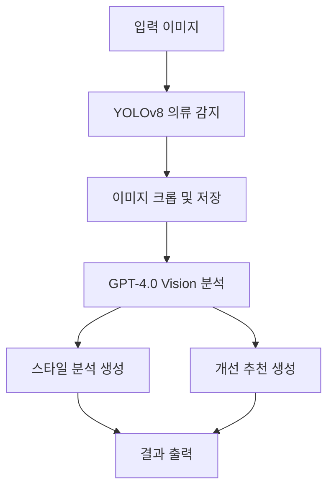
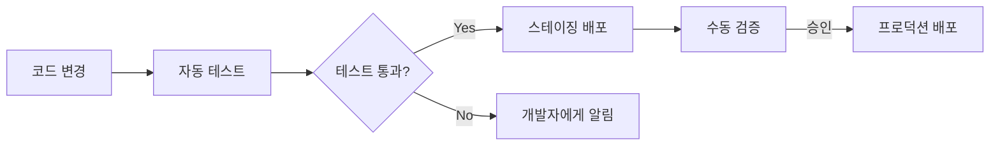

# fashion_ex

여기 패션 스타일 추천 개인화 시스템 구현을 위한 상세한 수행 절차서를 작성해 드리겠습니다:

# 패션 스타일 추천 개인화 시스템 구현 절차서

## 1. 시스템 개요 및 목표

### 1.1 시스템 개요
- 컴퓨터 비전과 자연어 처리 기술을 결합한 고급 패션 스타일 추천 시스템
- 입력 이미지에서 의류 아이템을 감지하고 사용자의 현재 스타일을 분석
- 개인화된 패션 조언과 개선 제안을 생성

### 1.2 주요 목표
- 정확한 의류 아이템 감지 및 분류
- 사용자 스타일에 대한 통찰력 있는 분석 제공
- 실용적이고 개인화된 패션 추천 생성
- 사용자 친화적인 인터페이스 구현

### 1.3 시스템 아키텍처


## 2. 데이터 준비 및 전처리

### 2.1 데이터셋 선택
- DeepFashion2 데이터셋 활용
- 491K 이미지, 13개 의류 카테고리 포함

### 2.2 데이터 전처리
- 이미지 크기 조정 및 정규화
- 레이블 인코딩
- 데이터 증강 기법 적용 (회전, 플립, 밝기 조정 등)

### 2.3 데이터 분할
| 데이터셋 | 비율 | 용도 |
|---------|------|------|
| 학습 데이터 | 70% | 모델 학습 |
| 검증 데이터 | 15% | 하이퍼파라미터 튜닝 |
| 테스트 데이터 | 15% | 최종 성능 평가 |

## 3. YOLOv8 모델 구현 및 학습

### 3.1 YOLOv8 아키텍처 설정
- 백본: CSPDarknet53
- 넥: SPP (Spatial Pyramid Pooling)
- 헤드: 3개의 검출 모듈 (다중 스케일 객체 감지)

### 3.2 모델 구성
```python
from ultralytics import YOLO

model = YOLO('yolov8n.yaml')  # n: nano 모델
model.model.head.nc = 13  # 13개 의류 클래스로 설정
```

### 3.3 학습 파라미터 설정
- 에폭: 100
- 배치 크기: 16
- 학습률: 0.01 (코사인 스케줄러 적용)
- 옵티마이저: AdamW

### 3.4 모델 학습 실행
```python
results = model.train(
    data='deepfashion2.yaml',
    epochs=100,
    imgsz=640,
    batch=16,
    name='fashion_detector'
)
```

### 3.5 성능 평가 및 최적화
- mAP (mean Average Precision) 모니터링
- 과적합 방지를 위한 조기 종료 적용
- 학습률 조정 및 데이터 증강 기법 최적화

## 4. GPT-4.0 Vision 통합

### 4.1 OpenAI API 설정
- API 키 발급 및 환경 변수 설정
- 요청 한도 및 비용 관리 계획 수립

### 4.2 프롬프트 엔지니어링
- 시스템 프롬프트 작성: 패션 전문가 페르소나 정의
- 사용자 프롬프트 템플릿 설계: 이미지 및 감지된 의류 정보 포함

### 4.3 API 요청 구현
```python
import openai

def analyze_style(image_path, detected_items):
    response = openai.ChatCompletion.create(
        model="gpt-4-vision-preview",
        messages=[
            {"role": "system", "content": "당신은 전문 패션 스타일리스트입니다..."},
            {"role": "user", "content": [
                {"type": "image_url", "image_url": {"url": image_path}},
                {"type": "text", "text": f"감지된 의류 아이템: {detected_items}"}
            ]}
        ],
        max_tokens=300
    )
    return response.choices[0].message.content
```

### 4.4 응답 처리 및 포맷팅
- JSON 구조화된 응답 파싱
- 스타일 분석과 개선 추천 섹션 분리

## 5. 시스템 통합 및 최적화

### 5.1 파이프라인 구축
1. 이미지 입력
2. YOLOv8을 통한 의류 감지
3. 감지된 아이템 크롭 및 저장
4. GPT-4.0 Vision에 이미지 및 감지 정보 전송
5. 스타일 분석 및 추천 생성
6. 결과 출력

### 5.2 성능 최적화
- YOLOv8 추론 시간 최적화 (TensorRT 적용 고려)
- GPT-4.0 Vision 요청 병렬 처리
- 이미지 전처리 파이프라인 효율화

### 5.3 에러 처리 및 로깅
- 예외 처리 구현 (네트워크 오류, API 한도 초과 등)
- 상세 로깅 시스템 구축 (학습 과정, 추론 결과, API 응답 등)

## 6. 사용자 인터페이스 개발

### 6.1 웹 애플리케이션 프레임워크 선택
- Flask 또는 FastAPI 활용

### 6.2 프론트엔드 설계
- 반응형 디자인 구현
- 이미지 업로드 및 미리보기 기능
- 결과 표시 레이아웃 설계

### 6.3 백엔드 API 구현
```python
from fastapi import FastAPI, File, UploadFile
from PIL import Image
import io

app = FastAPI()

@app.post("/analyze")
async def analyze_style(file: UploadFile = File(...)):
    image = Image.open(io.BytesIO(await file.read()))
    # YOLOv8 의류 감지
    detected_items = detect_clothes(image)
    # GPT-4.0 Vision 분석
    analysis = analyze_style(image, detected_items)
    return {"analysis": analysis}
```

## 7. 테스트 및 평가

### 7.1 단위 테스트
- YOLOv8 모델 정확도 검증
- GPT-4.0 Vision 응답 품질 평가
- API 엔드포인트 기능 테스트

### 7.2 통합 테스트
- 전체 파이프라인 동작 검증
- 다양한 입력 이미지에 대한 시스템 반응 테스트

### 7.3 사용자 평가
- 실제 사용자 대상 베타 테스트 진행
- 피드백 수집 및 분석

### 7.4 성능 메트릭 평가
| 메트릭 | 목표 |
|--------|------|
| YOLOv8 mAP | > 0.75 |
| 평균 응답 시간 | < 5초 |
| 사용자 만족도 | > 4.0/5.0 |

## 8. 배포 및 유지보수

### 8.1 클라우드 인프라 설정
- AWS 또는 GCP 환경 구축
- 컨테이너화 (Docker) 및 오케스트레이션 (Kubernetes) 적용

### 8.2 CI/CD 파이프라인 구축


### 8.3 모니터링 및 로깅 시스템 구축
- Prometheus와 Grafana를 활용한 실시간 모니터링
- ELK 스택 (Elasticsearch, Logstash, Kibana)을 이용한 로그 분석

### 8.4 지속적인 모델 업데이트
- 새로운 패션 트렌드 반영을 위한 정기적 모델 재학습
- A/B 테스트를 통한 모델 성능 개선 검증

## 9. 향후 개선 계획

### 9.1 기능 확장
- 사용자 프로필 기반 개인화 강화
- 계절별, 상황별 추천 기능 추가
- 가상 피팅 기능 통합

### 9.2 다국어 지원
- GPT-4.0의 다국어 능력을 활용한 글로벌 서비스 확장

### 9.3 모바일 앱 개발
- iOS 및 Android 네이티브 앱 출시
- 실시간 카메라 기반 스타일 분석 기능 구현

이 절차서는 패션 스타일 추천 개인화 시스템의 전체 구현 과정을 상세히 다루고 있습니다. 각 단계별로 필요한 기술적 세부사항과 고려사항을 포함하고 있으며, 시스템의 지속적인 개선과 확장을 위한 계획도 제시하고 있습니다. 이를 바탕으로 프로젝트를 진행하면 효과적인 패션 스타일 추천 시스템을 구축할 수 있을 것입니다.
